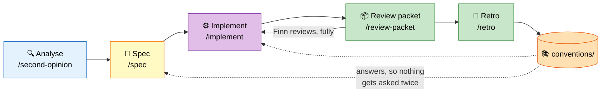

# 🛠 agent-skills

> Finn's Claude Code toolkit. The working loop, the conventions that feed it, and an
> inherited archive.

## 🔁 The loop

Every task runs the same five blocks. Only their extent shifts — a method extracted into a
use case gets an inline contract; a BLE protocol change gets a full proposal and six gates.



| Block | Rule |
|---|---|
| **Analyse** | Decisions rest on facts, never assumptions. Analysis is often requested *after* Finn's own, with his theory withheld — an independent read is the product. |
| **Spec** | Scope exact, out-of-scope explicit, gates by topic, model + effort chosen per gate. Tiered: no ceremony for a refactor, full proposal for a protocol change. |
| **Implement** | Transcription, not decision-making. Unknown → look it up; unanswerable → hard stop with options. Never an assumption. |
| **Review** | Finn's, entirely. The machine prepares a packet and gets out of the way. |
| **Retro** | The only stage that edits the system: friction becomes a rule, a memory, or a skill change. |

**Gates** are the load-bearing part: 2k-line diffs are unreviewable, so anything over
~400 lines or spanning more than one topic is split, reviewed, and optimised topic by
topic before the next one starts.

## 📚 Conventions

[`conventions/`](conventions/) is the answer database — naming, logging, architecture,
testing, git, Dart/Flutter, Kotlin. Lookup order before any question gets asked:

1. target repo `docs/conventions.md`
2. target repo `CLAUDE.md`
3. `$FLOW_CONVENTIONS` (default `~/agent-skills/conventions/`)
4. established pattern in the surrounding code

A question that survives all four is asked once — then written back.

## 🏪 Plugins

| Plugin | Skills | Description |
|--------|--------|-------------|
| [flow](flow/) | 5 | The loop: second-opinion, spec, implement, review-packet, retro |
| [review](review/) | 3 | Code review, security threat report, whole-repo tech debt audit |
| [dstoic](dstoic/) | 8 | Core: model/harness/workflow routing, scratch, context save/load, post-mortem, hooks |
| [cognitive](cognitive/) | 8 | Problem-solving: frame, troubleshoot, investigate, brainstorm, probe, experiment, challenge, benchmark |
| [openspec](openspec/) | 9 | Full-tier spec flow: plan, design, develop, review, test, reflect, replan, sync |
| [toolsmith](toolsmith/) | 4 | Authoring: edit-tool, edit-plugin, search-skill, install-dependency |
| [retrospect](retrospect/) | 3 | Session analysis: domain learnings, collaboration patterns, trend reports |
| [convert](convert/) | 6 | PDF, EPUB, DOCX, PPTX → markdown, markdown → PDF, Google Docs import |
| [content](content/) | 6 | anonymize, infographize, literatize, bridge, tune-voice, build-storyline |
| [cowork](cowork/) | 4 | Multi-project context: switch, save/load, ref/wip sync |
| [gtd](gtd/) | 5 | GTD workflow automation for Obsidian vaults |
| [biz](biz/) | 7 | Competitive analysis, UX strategy/wireframes/evaluation, market sizing |
| [experimental](experimental/) | 9 | Deployment, background tasks, distill-skill, context bootstrap |
| [philosopher](philosopher/) | 24 | Philosopher personas, dialogue, council |
| [coach](coach/) | 1 | Coaching: CLEAR + GROW |
| [lazy](lazy/) | 1 | Demand capture: placeholder skills that measure need before building |

`flow`, `review` and `conventions/` are Finn's. The rest is inherited from the
[digital-stoic](https://github.com/digital-stoic-org/agent-skills) fork and kept until it
earns its place or gets pruned.

## 📦 Install

```bash
claude plugin marketplace add https://github.com/alpenraum/agent-skills
claude plugin install flow@alpenraum-marketplace
```

Development goes through symlinks instead, so edits are live with no reinstall:

```bash
ln -s ~/agent-skills/flow/skills/spec ~/.claude/skills/spec
```

[INSTALL.md](INSTALL.md) has the rest — which path to pick, context cost, and what to check
when a slash command autocompletes nothing.

## 📄 Also here

- [CLAUDE.md](CLAUDE.md) — how this repo expects work to be done
- [INSTALL.md](INSTALL.md) — plugin vs symlink, context cost, troubleshooting
- [flow/BACKLOG.md](flow/BACKLOG.md) — capabilities `/retro` found missing
- [HARNESS-ENGINEERING.md](HARNESS-ENGINEERING.md), [benchmarks/](benchmarks/) — inherited research, kept as reference
