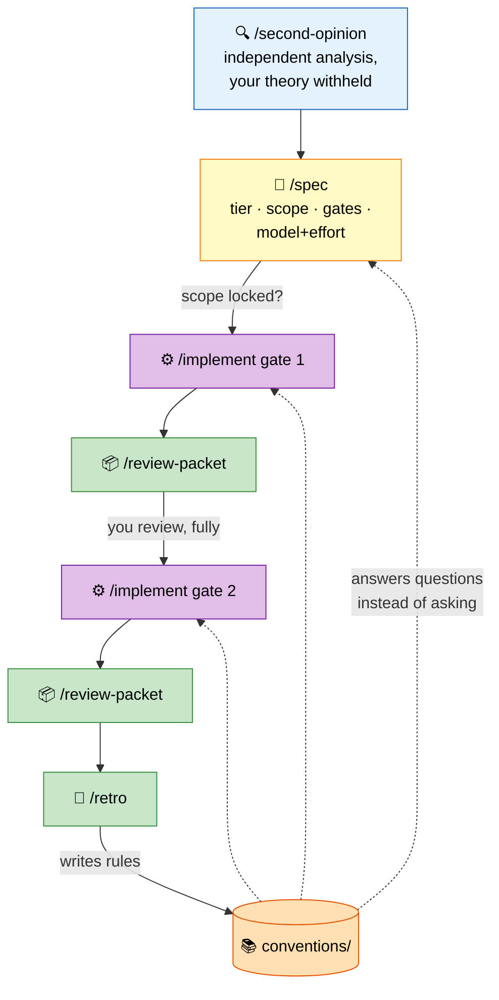

# 🔁 flow Plugin — The Working Loop

> Analyse. Spec. Implement in gates. You review. Retro writes the answers back.

## ✨ What

Five blocks that always run, with only their extent shifting per task. The loop's job is
to make the *next* task cheaper: every question that had to be asked once becomes a rule
in the conventions database, so it is never asked again.



## 🚀 Usage

```bash
/second-opinion the history graph doesn't update in real time until the screen is reopened
# ... independent analysis lands, you state your read, it reconciles

/spec fix the history graph stream            # picks tier, plans gates, calls model+effort
/implement history-graph-stream               # gate 1 only, then stops
/implement history-graph-stream gate 2        # after you accept gate 1
/retro history-graph-stream                   # friction -> conventions/ + memory + skills
```

## 📏 Spec tiers

| Tier | When | Artifact |
|---|---|---|
| micro | one topic, one layer, no behaviour change — method → use case, rename | inline, no file |
| standard | multiple layers, observable behaviour change, ≥2 topics | `docs/specs/<slug>.md`, committed |
| full | new capability, protocol/API change, cross-repo, firmware compat | `/openspec-plan` proposal + gate plan |

## 🚦 Gates

Split by **topic**, never by file count. Triggers: >~400 lines expected · more than one
topic · a layer boundary crossed · a risky change isolable from mechanical work.

Risky and architectural topics go first, mechanical follow-through last. Each gate carries
its own verification and its own model+effort call. Work stops dead at a gate boundary —
no "starting the next one while you look".

## 🤐 The no-assumption rule

Unknown → lookup order, not a guess and not an immediate question:

1. target repo `docs/conventions.md`
2. target repo `CLAUDE.md`
3. `$FLOW_CONVENTIONS` (default `$HOME/agent-skills/conventions/`)
4. established pattern in surrounding code

Only an unknown that survives all four becomes a question — batched, with concrete options
and a recommendation. The answer is written back to the right file immediately, so the
question count decays. Questions never time out.

## 📚 Conventions database

Lives at [`../conventions/`](../conventions/) — general, naming, logging, architecture,
testing, git, dart-flutter, kotlin. `TODO` marks an unanswered question; `/spec`,
`/implement`, and `/retro` remove them by use rather than by upfront authoring.

## 🔗 Neighbours

- `/challenge` — attacks an answer already on the table (opposite of `/second-opinion`)
- `/troubleshoot` — a plain error you just want fixed, no independent-analysis ceremony
- `/pick-model` — the live-session model/effort read `/spec` calls per gate
- `/openspec-plan` — the `full` tier
- `/code-review`, `/security-review` — your review, when you want a machine pass too

## 📦 Version

`0.1.0` · 5 skills (`/second-opinion`, `/spec`, `/implement`, `/review-packet`, `/retro`)
