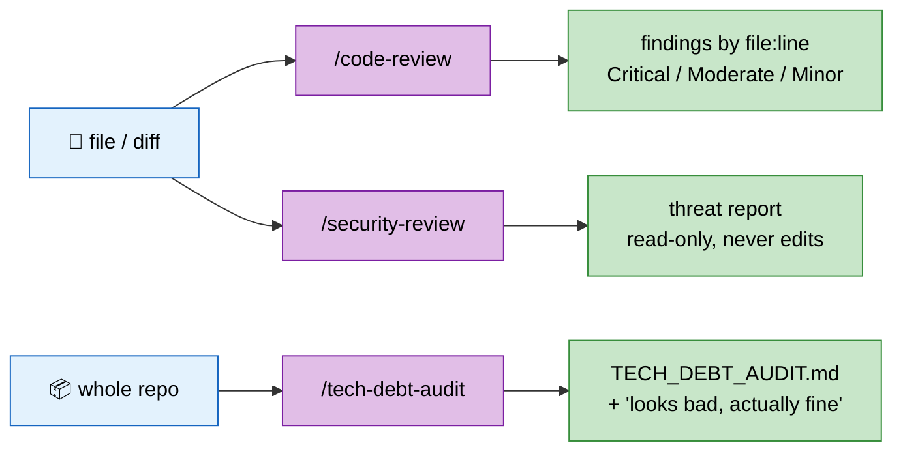

# 🔍 review Plugin — Code Review & Audit

> Three read-only reviewers: quality, security, debt. None of them write your code.

## ✨ What

Review work splits by altitude. `/code-review` reads a file or diff and flags what hurts readability, extensibility, maintainability, testability. `/security-review` reads the same code as an attacker and reports a threat inventory. `/tech-debt-audit` steps back to the whole repo and writes `TECH_DEBT_AUDIT.md`.

All three describe problems instead of patching them — the author keeps the fix decision.



## 🚀 Usage

```bash
/code-review src/auth/                # quality review, scoped
/code-review                          # current working directory
/security-review api/routes/login.ts  # threat report for one endpoint
/tech-debt-audit                      # whole-repo audit → TECH_DEBT_AUDIT.md
```

## 🧭 Which one

| Question | Skill |
|----------|-------|
| Is this code easy to read, extend, maintain, test? | `/code-review` |
| Can this code be attacked? | `/security-review` |
| Where is this repo bleeding time, and what is it costing? | `/tech-debt-audit` |

## 🔒 Constraints

- `code-review`, `security-review`: `allowed-tools: Read, Grep, Glob` — no edits possible by construction.
- `security-review` reads every in-scope file directly; no subagent summaries, so a file it never read is never marked reviewed.
- `tech-debt-audit` sets `disable-model-invocation: true` — user-invoked only, because a full-repo audit is too expensive to trigger by accident.

## 📦 Version

`0.1.0` · 3 skills (`/code-review`, `/security-review`, `/tech-debt-audit`)
